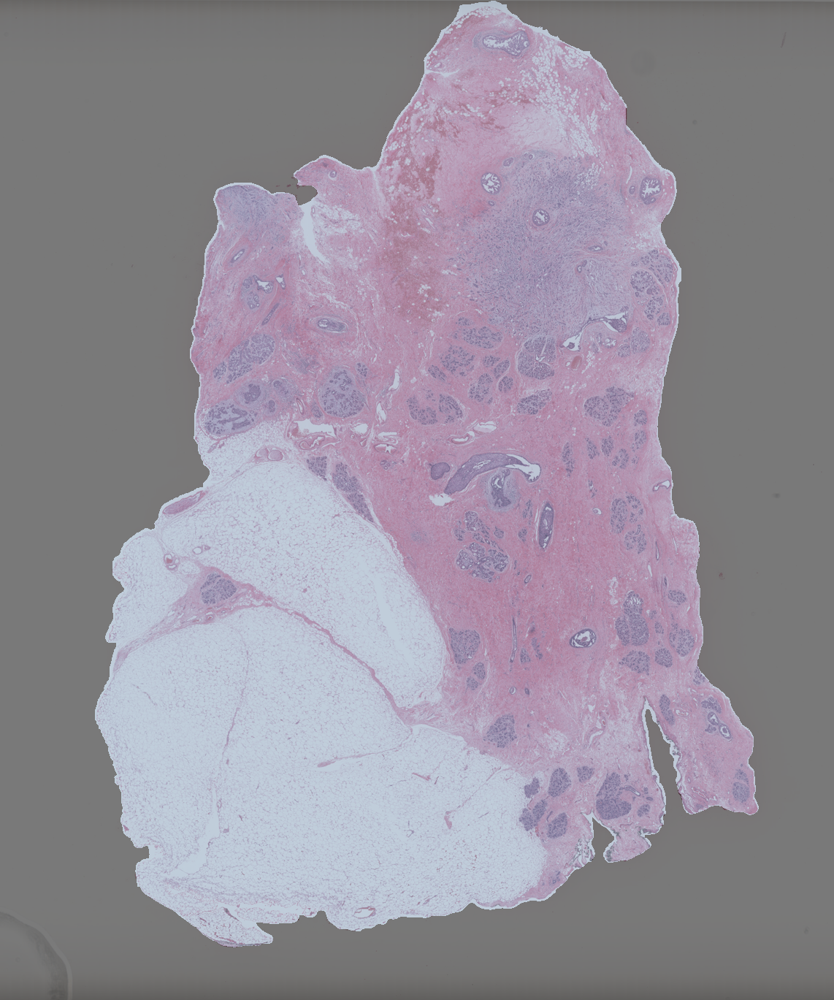
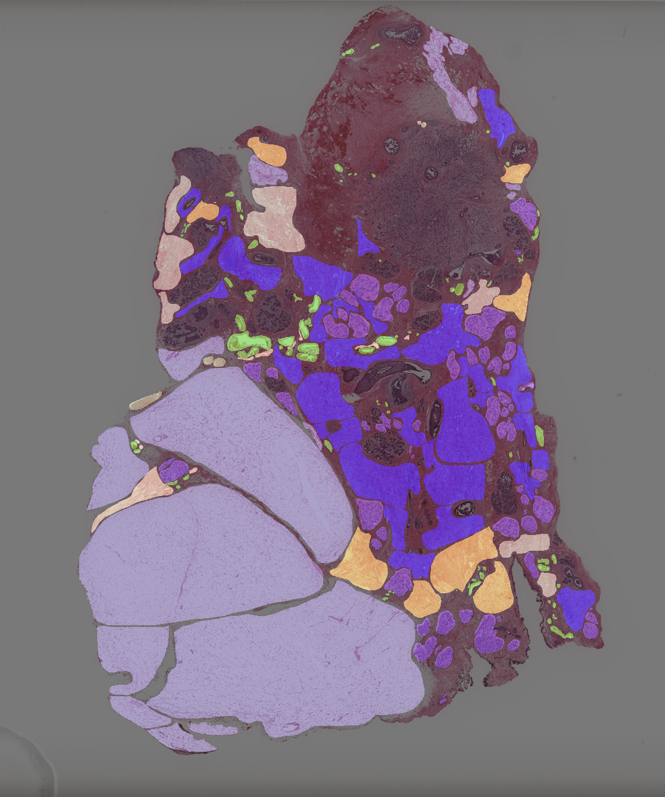
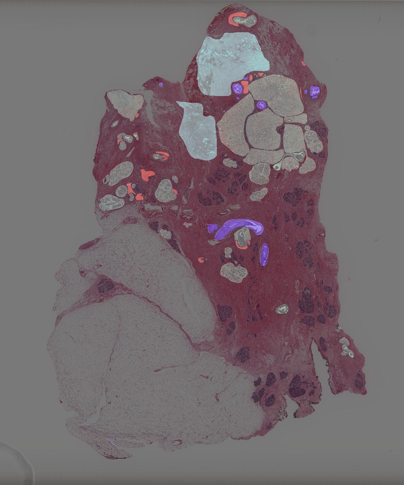

First, setup your environment:
```bash
pip -r requirements.txt
```

## Profile

Generate the profile json using the exported csv from Google Docs:
```bash
python create_profile_from_gdoc_csv.py
```

Javascript to visualize the profile: [profile_v1.json](https://rawcdn.githack.com/human-centered-ai-lab/WSIDOM/5513adfa895773f22755304a447b8053a3044fd1/profile_viewer/index.html)

## Examples

To run the provided examples, first download the example slide from the TCGA:

```bash
cd examples
./gdc-client download 978e66db-80be-4b80-9142-09577aa97241
```

### Visualize the Annotations

```bash
# Organs
python visualize.py --annotation_path examples/source.geojson --svs_path examples/978e66db-80be-4b80-9142-09577aa97241/TCGA-BH-A1FE-01Z-00-DX1.8FB57ECF-350B-44E4-8612-63E8374D3C4B.svs  --profile_path profiles/tissue_types_v1.json --output_path output/source.png --output_resolution 16
# Tissue Types
python visualize.py --annotation_path examples/tissue_types.geojson --svs_path examples/978e66db-80be-4b80-9142-09577aa97241/TCGA-BH-A1FE-01Z-00-DX1.8FB57ECF-350B-44E4-8612-63E8374D3C4B.svs  --profile_path profiles/tissue_types_v1.json --output_path output/tissue_types.png --output_resolution 16
# Pathological Alterations
python visualize.py --annotation_path examples/pathological_alterations.geojson --svs_path examples/978e66db-80be-4b80-9142-09577aa97241/TCGA-BH-A1FE-01Z-00-DX1.8FB57ECF-350B-44E4-8612-63E8374D3C4B.svs --profile_path profiles/tissue_types_v1.json --output_path output/pathological_alterations.png --output_resolution 16
```
Generates the following images:

<p float="center">
  
   
  
</p>

### Export the Annotations as a .png

```bash
python export.py --layer_1_path examples/source.geojson --layer_2_path examples/tissue_types.geojson --layer_3_path examples/pathological_alterations.geojson --output_path output/annotation.png --output_resolution 16 --profile_path profiles/tissue_types_v1.json --svs_path examples/978e66db-80be-4b80-9142-09577aa97241/TCGA-BH-A1FE-01Z-00-DX1.8FB57ECF-350B-44E4-8612-63E8374D3C4B.svs
```
Saves the annotations in the three channels of a .png:

  
